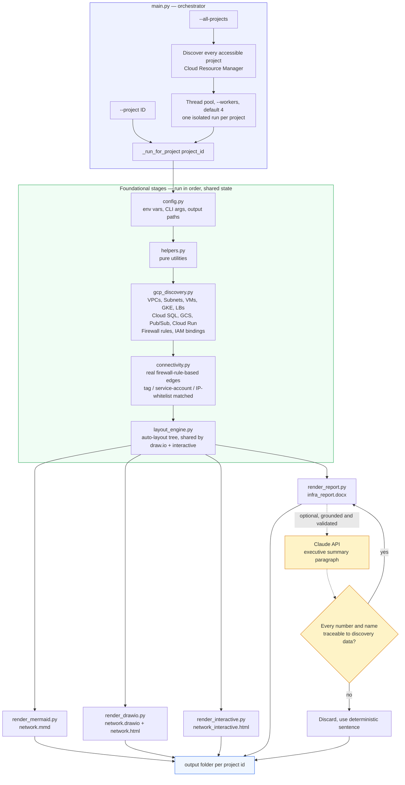

# GCP (+ Azure) Network Diagram & Infra Report Generator

Read-only discovery tool that turns a live GCP project — or every GCP project your account can see — into:

- 📊 **Network diagrams**: Mermaid, draw.io (collapsible), and a standalone interactive HTML you can hover/click to trace real connections
- 📄 **A Word document infrastructure report** per project — resource inventory, subnets, load balancers, managed services
- 🔁 **Real connectivity**, not guesses — edges come from actual firewall rules, IAM bindings, and LB backend wiring, not proximity or naming conventions
- 🗂️ **Isolated per-project output**, runnable for one project or your whole org in a single command

Everything the tool does is **read-only** — Viewer-level access is all it ever needs.

---

## Why this exists

Most "auto-generate a cloud diagram" tools draw a box per resource type and call it done. This one instead asks the question an actual audit needs answered: *what can talk to what, and why?*

- A VM-to-VM edge is only drawn when a real firewall rule, a real IAM binding, or a real IP allowlist entry supports it — not because two resources happen to sit in the same VPC.
- Load balancers are wired to their actual GKE cluster or backend, resolved from real forwarding-rule → backend-service → target chains — not dropped in a flat, undifferentiated pile.
- The infrastructure report's numbers are the exact same discovery data the diagrams are built from, just formatted — nothing in it is generated text pretending to be a fact (see [AI Executive Summary](#optional-ai-executive-summary) for the one narrow exception, and how it's kept honest).

## Quickstart

```bash
pip install -r requirements.txt --break-system-packages
gcloud auth application-default login

echo "PROJECT_ID=your-gcp-project-id" > .env

python main.py
```

Output lands in `output/<project-id>/`. Full setup (Azure credentials, GCP permissions, `.env` reference) is in **[SETUP.md](SETUP.md)**.

### Run it across your whole org

```bash
python main.py --all-projects --workers 8
```

Every accessible project gets its own isolated `output/<project-id>/` folder, generated concurrently.

## Architecture

Each stage below runs in dependency order into one shared namespace, then the three diagram renderers and the report generator run independently — a bug in one output format never costs you the others.



## Outputs

| File | What it's for |
|---|---|
| `network.mmd` | Mermaid source — paste into any Mermaid renderer |
| `network.drawio` / `network.html` | Open in draw.io desktop or [app.diagrams.net](https://app.diagrams.net) — collapsible containers |
| `network_interactive.html` | Fully standalone, works offline — hover/click to trace a resource's real connections |
| `infra_report.docx` | Word doc: resource inventory, per-VPC subnet tables, load balancers, managed/PaaS services |

## Optional: AI Executive Summary

`infra_report.docx` includes an Executive Summary paragraph. By default it's a plain templated sentence built from the same counts as the rest of the report. You can optionally have Claude write that one paragraph instead:

```ini
# .env
ENABLE_AI_SUMMARY=true
ANTHROPIC_API_KEY=sk-ant-...
```

**How hallucination is kept out of it:** the model is given *only* the pre-computed resource facts as JSON and told to describe them and nothing else — then its output is checked mechanically before it's allowed into the document: every number and every resource-name-shaped token in the generated text must already exist in that same facts object, or the whole paragraph is discarded in favor of the deterministic sentence. This isn't a promise the model won't embellish — it's a filter that doesn't care whether it tried. Every other section of the report never goes near a generative model in the first place; it's formatted directly from the discovery data, the same source the diagrams use.

## Requirements

- Python 3.9+
- A GCP identity with **Viewer** on the target project(s) — this tool never writes anything
- Optional: Azure Reader credentials to include Azure resources in the same diagram (see [SETUP.md](SETUP.md) §3)
- Optional: an Anthropic API key for the AI executive summary (see above)

Full install, credentials, `.env` reference, and troubleshooting: **[SETUP.md](SETUP.md)**

## License

Add your license here.
